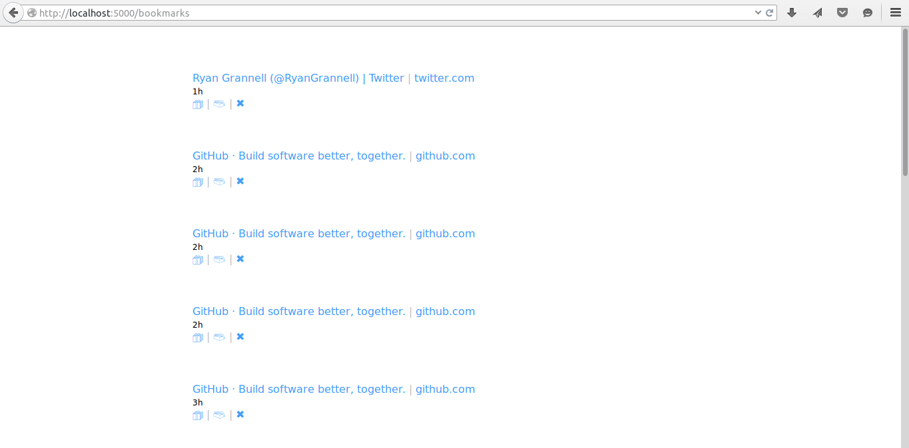

# engr.am [](https://travis-ci.org/rgrannell1/engram.py)

</img>

engr.am is a simple tool to fit my need for a bookmarking tool. Rather than having several browser plugins, engr.am gets you ninety percent of the functionality with:

```
engr.am/http://myfavouritesite.com
```

very simple.

* **locally-hosted**: I prefer to have control over my own bookmarks, and it is frustrating trying to save 
links on a bad network.

* **archiving**: engr.am creates a PDF copy of every bookmark. The result isn't always pretty, but it guarantees you'll never lose data through link-rotting.

* **sharing**: engr.am supports Twitter sharing without using .

* **api**:

## Tags

engr.am does not support manual tagging, as it is hard to assign meaningful tags to many bookmarks without mislabelling. Instead, engr.am extracts keywords from your documents you can use to search by.

## Search 

<kbd>Ctrl + F</kbd>

## Licence

engr.am is released under the MIT licence.

The MIT License (MIT)

Copyright (c) 2014 Ryan Grannell

Permission is hereby granted, free of charge, to any person obtaining a copy of this software and associated documentation files (the "Software"), to deal in the Software without restriction, including without limitation the rights to use, copy, modify, merge, publish, distribute, sublicense, and/or sell copies of the Software, and to permit persons to whom the Software is furnished to do so, subject to the following conditions:

The above copyright notice and this permission notice shall be included in all copies or substantial portions of the Software.

THE SOFTWARE IS PROVIDED "AS IS", WITHOUT WARRANTY OF ANY KIND, EXPRESS OR IMPLIED, INCLUDING BUT NOT LIMITED TO THE WARRANTIES OF MERCHANTABILITY, FITNESS FOR A PARTICULAR PURPOSE AND NONINFRINGEMENT. IN NO EVENT SHALL THE AUTHORS OR COPYRIGHT HOLDERS BE LIABLE FOR ANY CLAIM, DAMAGES OR OTHER LIABILITY, WHETHER IN AN ACTION OF CONTRACT, TORT OR OTHERWISE, ARISING FROM, OUT OF OR IN CONNECTION WITH THE SOFTWARE OR THE USE OR OTHER DEALINGS IN THE SOFTWARE.
Versioning.

All versions post-release will be compliant with the Semantic Versioning 2.0.0 standard.

http://semver.org/


